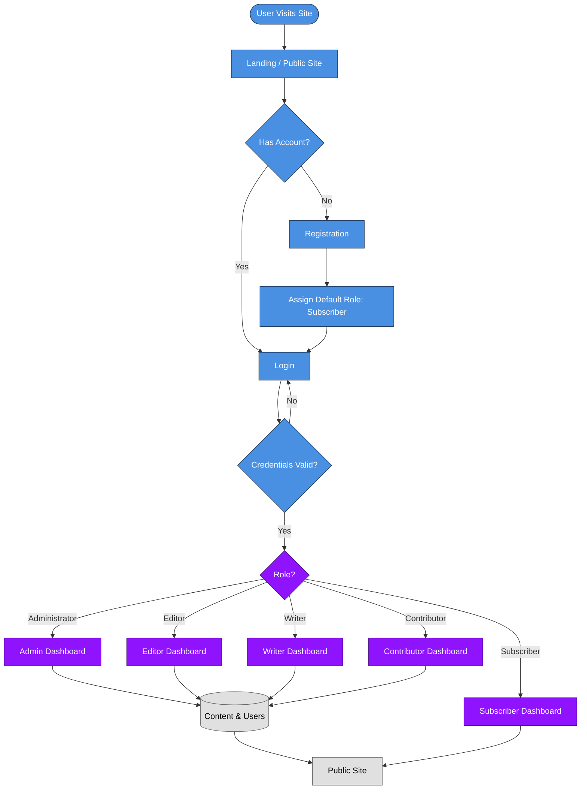
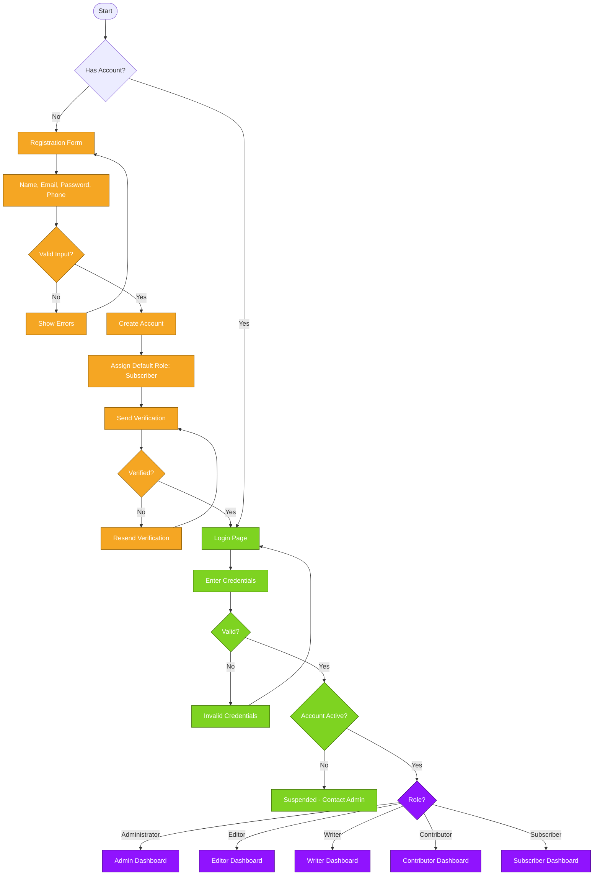
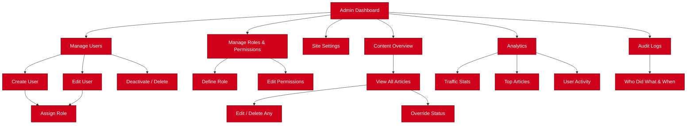
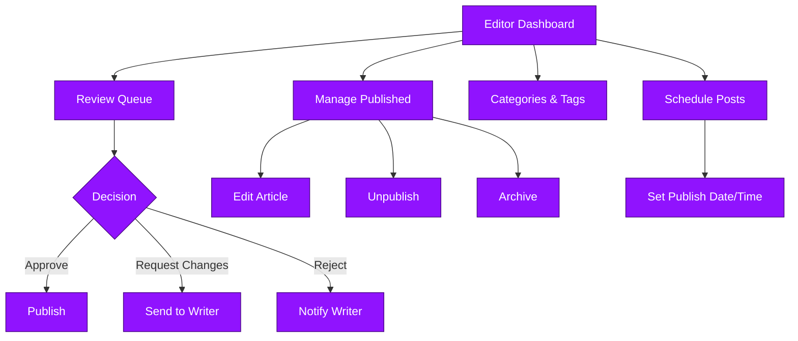
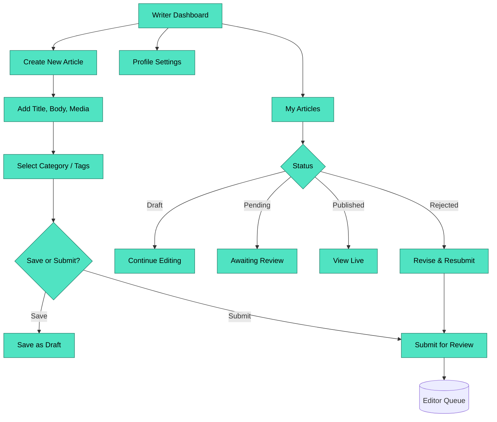
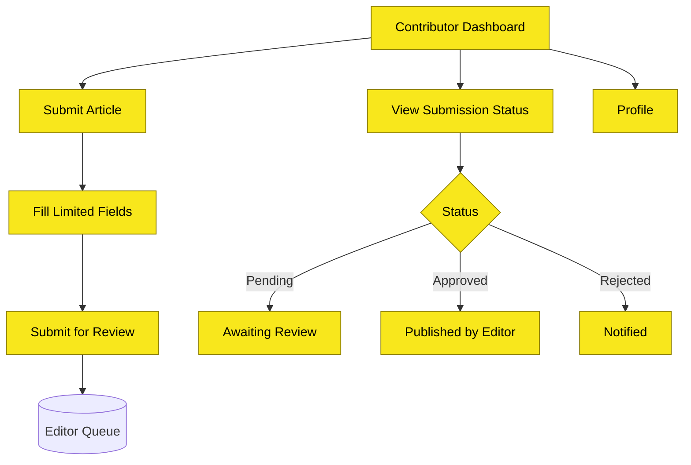
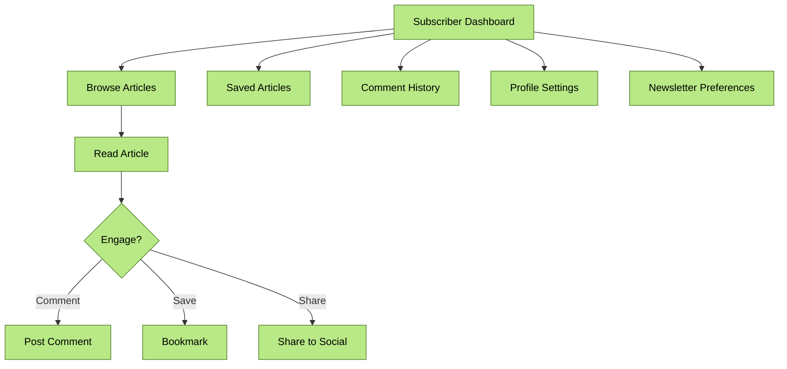
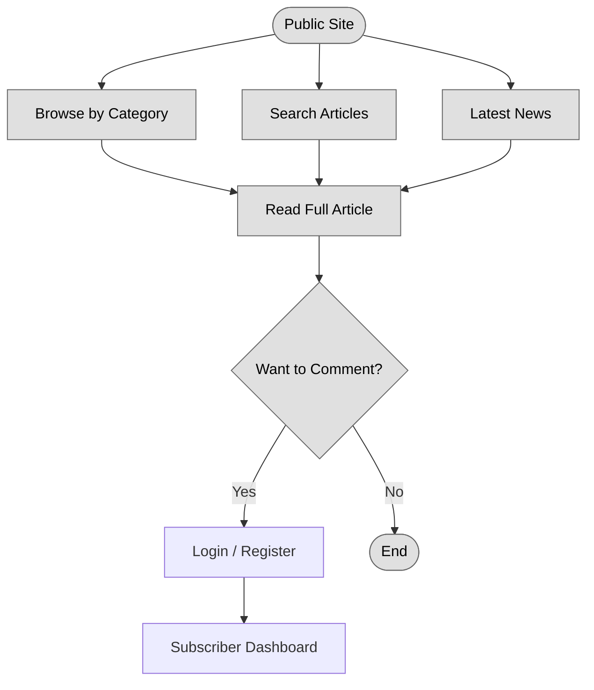
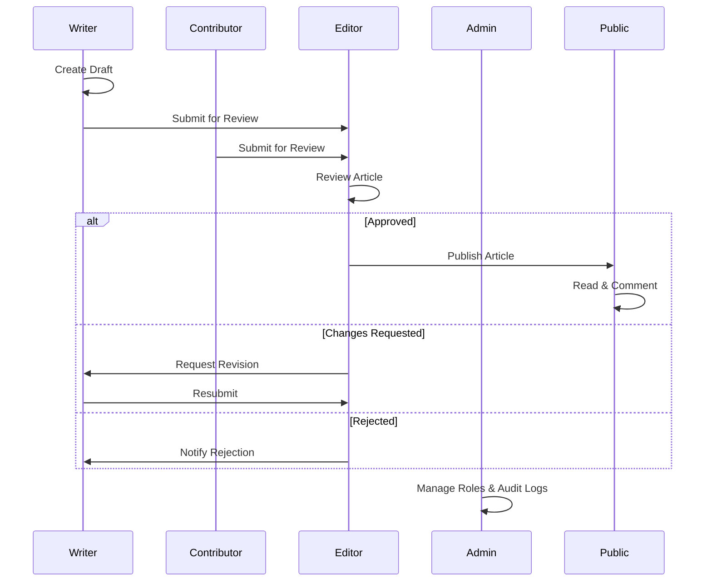
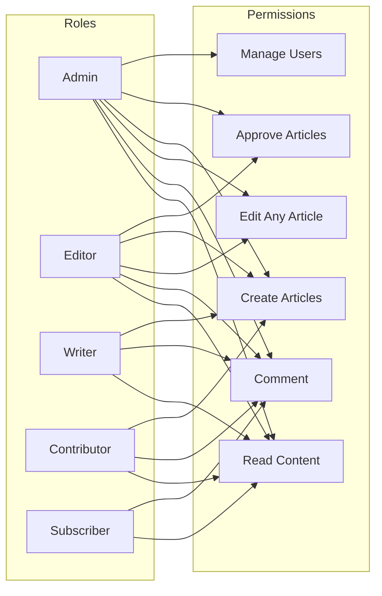

# The Egerton Advertiser

The Egerton Advertiser is a modern online newspaper and content management system (CMS) built with Django. The project is designed to provide a professional platform for publishing campus and community news while giving editors and administrators complete control through a custom dashboard.

Unlike WordPress-based newspaper websites, this project is being developed entirely from code, making it highly customizable, scalable, and easy to extend as new requirements emerge.

The system features role-based authentication and access control, ensuring that each user interacts only with the tools and content relevant to their role. Roles include:

Administrator — full system access; manages users, roles, site settings, and overall platform configuration.

Editor — reviews, approves, edits, and publishes articles submitted by writers; manages categories and content workflow.

Writer / Journalist — creates and submits articles, uploads media, and tracks the status of their submissions.

Contributor — submits content for review with limited publishing privileges.

Subscriber / Reader — views published content, comments, and receives updates.

Each role is assigned granular permissions through Django's authentication and authorization framework, so access to the dashboard, publishing tools, and administrative functions is tightly controlled. This role-based structure improves security, streamlines editorial workflows, and ensures accountability across the platform.






















---

## Features

### Public Website

- Homepage with featured headlines
- Breaking news ticker
- Latest news section
- News categories
- Search functionality
- Responsive design
- Advertisement placements
- Newsletter subscription
- Author profiles
- Reader comments
- Contact page

### Admin Dashboard

- Custom admin dashboard
- User and role management
- Article management
- Category management
- Tag management
- Advertisement management
- Media library
- Newsletter management
- Contact message management
- Website analytics
- Site settings

---

## Technology Stack

- Python
- Django
- Bootstrap 5
- HTMX
- CKEditor
- SQLite (Development)
- PostgreSQL (Production)
- HTML5
- CSS3
- JavaScript

---

## Project Structure

```text
egerton_advertiser/
│
├── apps/
│   ├── accounts/
│   ├── dashboard/
│   ├── articles/
│   ├── categories/
│   ├── tags/
│   ├── comments/
│   ├── advertisements/
│   ├── media_library/
│   ├── newsletter/
│   ├── contacts/
│   ├── analytics/
│   ├── search/
│   ├── notifications/
│   └── settings_manager/
│
├── templates/
├── static/
├── media/
├── egerton_advertiser/
├── requirements.txt
└── manage.py
```

---

## Installation

### 1. Clone the repository

```bash
git clone https://github.com/eKidenge/egerton_advertiser.git
```

### 2. Navigate into the project

```bash
cd egerton_advertiser
```

### 3. Create a virtual environment

```bash
python -m venv venv
```

### 4. Activate the virtual environment

**Windows**

```bash
venv\Scripts\activate
```

**Linux/macOS**

```bash
source venv/bin/activate
```

### 5. Install dependencies

```bash
pip install -r requirements.txt
```

### 6. Apply database migrations

```bash
python manage.py migrate
```

### 7. Create a superuser

```bash
python manage.py createsuperuser
```

### 8. Start the development server

```bash
python manage.py runserver
```

Open your browser and visit:

```
http://127.0.0.1:8000/
```

---

## 
Project Status

Completed Work

The Egerton Advertiser newspaper management system has been fully developed, tested, and deployed. The completed system includes:

- Complete newspaper website and content management system (CMS)
- Custom administration panel
- Rich text editor for article creation and formatting
- Article, category, and publication management
- Scheduled publishing
- Advanced analytics and readership insights
- Advertisement management and tracking
- Newsletter campaign management
- REST API
- Push notifications
- SEO optimization and search-engine-friendly content structure
- Responsive and user-friendly interface
- User and administrative access controls
- Database and backend management
- Performance and scalability enhancements
- Production configuration and deployment
- Full system testing and verification on Render
- Successful testing and approval at egertonadvertiser.onrender.com

Following successful testing and approval, the completed system was deployed to the client's production domain:

https://egertonadvertiser.co.ke

Deployment Status

Development: Complete
Testing: Complete
Client Approval: Complete
Production Deployment: Complete
Live Website: egertonadvertiser.co.ke

---

## Vision

The Egerton Advertiser aims to become a modern digital newspaper platform for the Egerton University community. Beyond serving as a news portal, the project is also an opportunity to demonstrate scalable Django development practices and build a flexible CMS that can grow with future needs.

---

## Contributing

Contributions, suggestions, and feedback are welcome. If you'd like to contribute, feel free to fork the repository, open an issue, or submit a pull request.

---

## License

This project is licensed under the MIT License.

---

**Developed by Elisha Kidenge**
